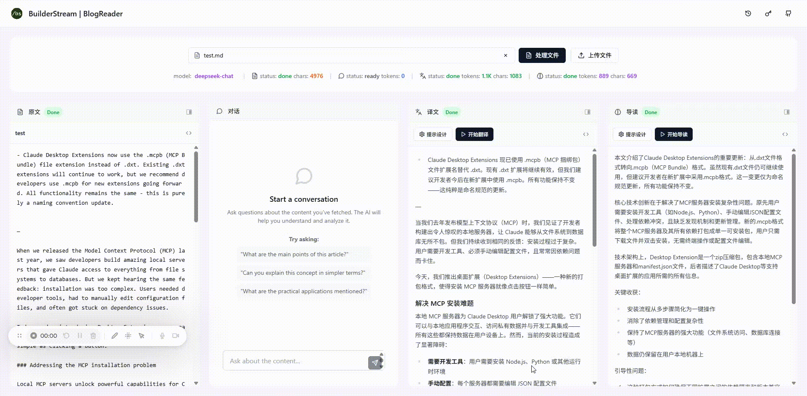

# AI 博客解读助手

一个基于 AI 的博客解读工具，可以自动爬取网页内容，进行中文翻译和智能解读。



## 🚀 功能特性

- **智能爬取**: 自动提取网页正文内容
- **多 LLM 支持**: DeepSeek、OpenAI、Claude、Ollama、LM Studio
- **AI 翻译**: 高质量的中英文翻译
- **智能解读**: AI 分析文章核心要点
- **文件导入**: 支持上传本地 Markdown/文本文件
- **内容导出**: 支持复制内容和下载为文件

## 🛠️ 技术栈

- **前端**: React 18 + TypeScript + Vite + Tailwind CSS
- **后端**: Supabase Edge Functions / FastAPI
- **AI 服务**: 多 LLM 支持
- **部署**: Cloudflare Pages / Docker

## 📦 快速开始

### 本地开发

```bash
# 克隆项目
git clone https://github.com/your-username/bs-blogreader.git
cd bs-blogreader

# 安装前端依赖
cd frontend
npm install
npm run dev

# 启动后端 (另一个终端)
cd backend
pip install -r requirements.txt
python llm_main.py
```

### Docker 部署

```bash
docker-compose up -d
```

## 🔧 配置

1. 设置 LLM API Key (DeepSeek/OpenAI/Claude) 或配置本地 LLM (Ollama/LM Studio)
2. 在应用中点击钥匙图标进行配置
3. 测试连接确保配置正确

## 📖 使用指南

1. 输入网页 URL 或上传文件
2. 点击"开始爬取"获取内容
3. 使用"开始翻译"和"开始解读"进行 AI 处理
4. 查看结果并导出内容

## 🤝 贡献

欢迎提交 Issue 和 Pull Request！

## 📄 许可证

MIT License